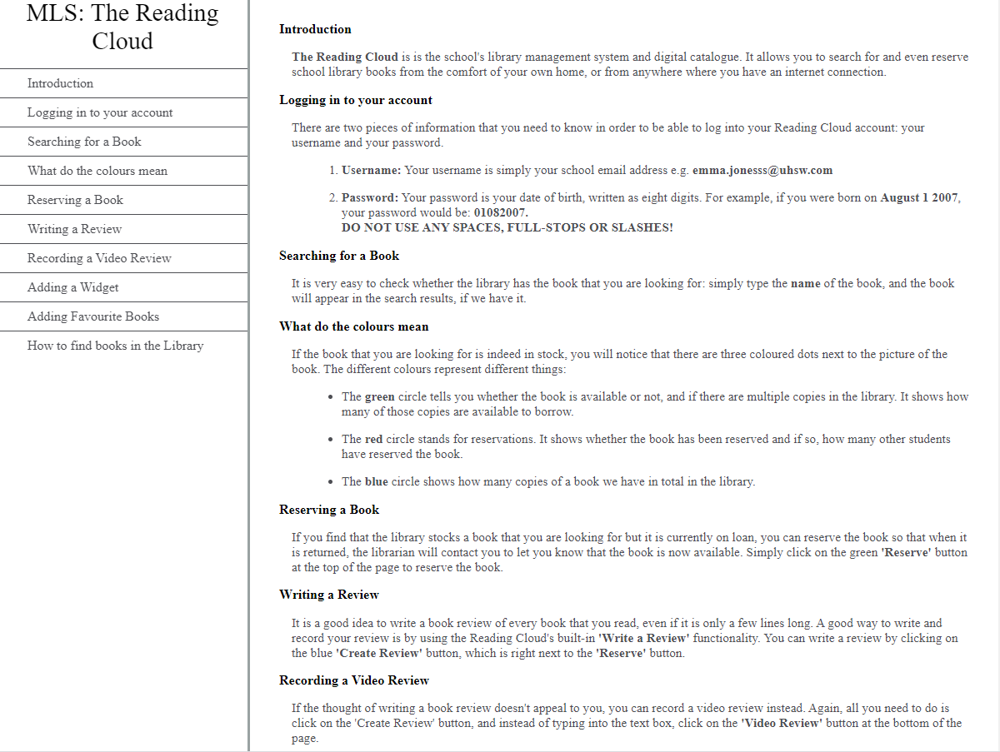
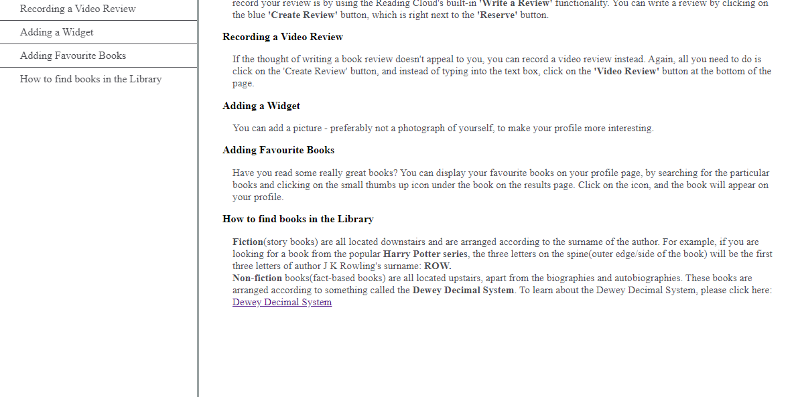

# Reading Cloud Tutorial

## Instructions on how to use the Reading Cloud, aimed at secondary school students. 

* Created with HTML and CSS
* One of the freeCodeCamp responsive web design projects 

## What it looks like:

